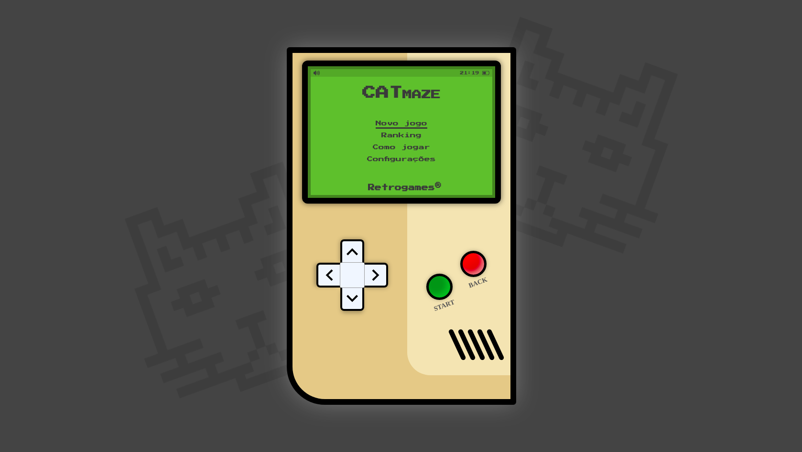

<p align="center">
  
</p>
<hr>
<br>


<h2 align="center">
  Projeto: CATmaze
</h2>
<br>

<blockquote align="center">“A lógica pode levar de um ponto A a um ponto B. A imaginação pode levar a qualquer lugar” 

(Einstein)</blockquote>
<br>

<p align="center">

  <a href="LICENSE">
    
  </a>
  <a href="NPM">
    
  </a>
  <a href="GitHub followers">
    
  </a>
</p>
<hr>

<br>
<br>


# :rocket: Sobre o projeto

CATmaze nasceu a partir do desafio de criar um clássico jogo de labirinto, logo me veio a mente de recriar a famosa estética dos consoles portáteis dos anos 90. 

Um dos requisitos deste desafio era ter sua navegação 100% guiada por eventos DOM de teclado. Ao realizar os primeiros teste, identifiquei que a primeira ação dos usuários era de usar o mouse, para reverter este problema e melhorar a usabilidade criei um aviso sobre quais teclas devem ser usadas, assim que o usuário clica com o mouse sobre o console o mesmo realiza um movimento de flip e mostra um pequeno manual.

**CATmaze é um projeto realizado no curso de desenvolvimento full stack Kenzie Academy Brasil.**

<br>

## :computer: Tecnologias utilizadas
A seguinte stack foi utilizada na construção do projeto:

- HTML
- CSS
- JavaScript
- JQuery

<br>

## :construction_worker: Clone e contribua!

```
git clone https://github.com/BrunoBelarminoNog/cat-maze.git
```

URLs SSH fornecem acesso a um repositório Git via SSH, um protocolo seguro. Se você tiver uma chave SSH registrada em
sua conta do Github, clone o projeto usando este comando:

```
git clone git@github.com:BrunoBelarminoNog/cat-maze.git
```

<br>

# :art: Layout


<p align="center">
  
</p>


# :pushpin: Contribuindo

Sinta-se à vontade para registrar um novo problema com o respectivo título e descrição no repositório Foodfy . Se você já encontrou uma solução para o problema, eu adoraria revisar sua solicitação de pull!

Verifique a página de contribuição para ver os melhores lugares para registrar problemas, iniciar discussões e começar a contribuir.


# :unlock: Licença
Lançado em 2020. Este projeto está sob a licença do MIT .

Feito com muita dedicação por Bruno Belarmino :zap:

Me siga nas redes! [LinkdIn](https://www.linkedin.com/in/bruno-belarmino-nog/)